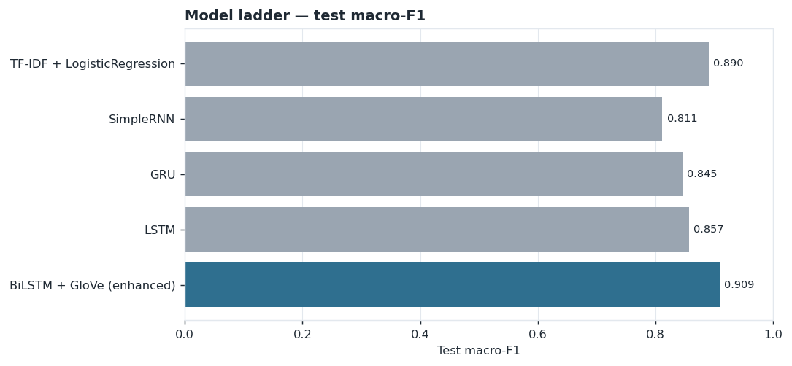
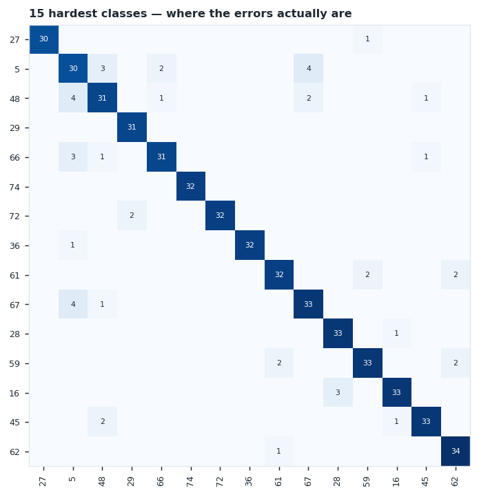
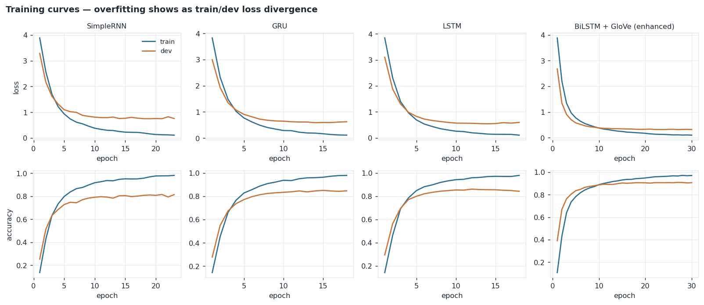

# Test-6 · Recurrent and transfer-learning models with performance enhancement

**Task** Banking77 intent classification — 77 customer-query intents  
**Module** FWC AI/ML · Module 5 (Sequence Modeling & NLP)  
**Hardware** CPU only  
**Generated** 04 September 2026, 21:24 — every number below is read from `artifacts/`

## 1. Dataset and protocol

| Split | Rows | Role |
| --- | --- | --- |
| train | 9,973 | fitting |
| dev | 3,080 | validation, early stopping, model selection |
| test | 3,080 | held out — evaluated once per rung |

No hyperparameter was chosen on the test set. Class sizes range across the 77 intents with an imbalance ratio of 5.34×, which is why **macro-F1 is the primary metric** — accuracy would let the model coast on the larger classes.

Preprocessing was deliberately minimal: lowercase, strip URLs and punctuation, nothing else. No stopword removal and no lemmatisation, because Banking77 intents turn on exactly the words a stopword list deletes — *card not working* and *card working* are different intents. Queries are short (mean 12.0 tokens, 95th percentile 29), so `MAX_LEN=40` leaves 98.6% of training sentences untruncated.

The shared word-level vocabulary is 2,388 entries and leaves **0.69% of dev tokens out of vocabulary**. Keep that number in mind for §4 — it is one of the concrete reasons the subword-tokenised Transformer pulls ahead.

## 2. Comparison table

|   Rung | Model                       |   Dev macro-F1 |   Test macro-F1 |   Test accuracy |   Test macro-P |   Test macro-R |   Δ vs floor (pp) |   Δ vs previous (pp) |
|-------:|:----------------------------|---------------:|----------------:|----------------:|---------------:|---------------:|------------------:|---------------------:|
|      0 | TF-IDF + LogisticRegression |         0.8903 |          0.8903 |          0.8899 |         0.8952 |         0.8899 |              0    |               nan    |
|      1 | SimpleRNN                   |         0.8115 |          0.8115 |          0.8107 |         0.8209 |         0.8107 |             -7.88 |                -7.88 |
|      2 | GRU                         |         0.8454 |          0.8454 |          0.8451 |         0.8504 |         0.8451 |             -4.49 |                 3.39 |
|      3 | LSTM                        |         0.857  |          0.857  |          0.8568 |         0.8629 |         0.8568 |             -3.33 |                 1.16 |
|      4 | BiLSTM + GloVe (enhanced)   |         0.909  |          0.909  |          0.9091 |         0.9119 |         0.9091 |              1.88 |                 5.2  |

### Cost side of the same table

| Model                       | Params    |   Size (MB) |   Epochs | Train time   |
|:----------------------------|:----------|------------:|---------:|:-------------|
| TF-IDF + LogisticRegression | 1,817,816 |       15.4  |      nan | 20 s         |
| SimpleRNN                   | 254,365   |        3.08 |       23 | 77 s         |
| GRU                         | 275,677   |        3.34 |       18 | 2.2 min      |
| LSTM                        | 286,045   |        3.46 |       18 | 2.0 min      |
| BiLSTM + GloVe (enhanced)   | 404,957   |        9.92 |       30 | 14.5 min     |



## 3. What each rung changed, and what it bought

**Rung 0 · TF-IDF + LogisticRegression** — test macro-F1 **0.8903**

Sparse frequency features, no word order, no semantics. The number every neural model must beat.

`ngram_range=1-2`, `max_features=50000`, `C=5.0`

**Rung 1 · SimpleRNN** — test macro-F1 **0.8115** — -7.88 pp vs the rung above

Adds memory and word order, but BPTT gradients vanish over long spans.

`units=64`, `batch_size=64`, `lr=0.001`, `max_len=40`

Early stopping restored epoch 19 of 23.

**Rung 2 · GRU** — test macro-F1 **0.8454** — +3.39 pp vs the rung above

Two gates (update, reset) give the network a gradient highway with few extra parameters.

`units=64`, `batch_size=64`, `lr=0.001`, `max_len=40`

Early stopping restored epoch 14 of 18.

**Rung 3 · LSTM** — test macro-F1 **0.8570** — +1.16 pp vs the rung above

Three gates plus an additively-updated cell state — the classic long-range memory fix.

`units=64`, `batch_size=64`, `lr=0.001`, `max_len=40`

Early stopping restored epoch 14 of 18.

**Rung 4 · BiLSTM + GloVe (enhanced)** — test macro-F1 **0.9090** — +5.20 pp vs the rung above

Same LSTM, four enhancements: bidirectional reading, pre-trained GloVe init, dropout, LR scheduling.

`units=96`, `bidirectional=True`, `embeddings=GloVe 100d (glove-wiki-gigaword-100)`, `glove_coverage=0.9426`, `embeddings_trainable=True`, `dropout=0.3`, `dense_dropout=0.4`, `lr_schedule=ReduceLROnPlateau(factor=0.5, patience=2)`, `batch_size=64`, `max_len=40`

Early stopping restored epoch 27 of 30.

## 4. Reading the result

**Gating is worth 4.56 pp.** SimpleRNN reaches 0.8115, LSTM 0.8570. Backpropagation through time multiplies gradients through the same recurrent weight matrix at every step, so a plain RNN's signal from early tokens decays before it reaches the loss. The LSTM's cell state is updated *additively* through a forget gate, giving gradients a near-lossless path across the sequence. On queries this short the gap is smaller than it would be on long documents — the failure mode scales with sequence length.

**GRU vs LSTM behaves as the theory predicts.** GRU 0.8454 against LSTM 0.8570 — a 1.16 pp difference from 275,677 parameters versus 286,045, and GRU trained -8% slower. Two gates instead of three, no separate cell state. On short text the extra LSTM machinery has little to do, which is exactly why GRU is the sensible default on small and medium data.

**The enhancement rung moved macro-F1 by +5.20 pp** over the plain LSTM. Four changes were applied together: bidirectional reading, GloVe initialisation (covering 94.3% of the vocabulary), dropout (0.3 recurrent / 0.4 dense), and ReduceLROnPlateau. The GloVe swap is doing most of the work: with only 9,973 training sentences there is not enough signal to learn 100-dimensional embeddings from scratch, so starting from vectors trained on 6B tokens is transfer learning applied at the embedding layer.

## 5. Error analysis

280 of 3080 test queries are misclassified by BiLSTM + GloVe (enhanced) (9.09%). The errors are not spread evenly — they concentrate in genuinely overlapping intent pairs:

| Count | True intent | Predicted | Example query |
| --- | --- | --- | --- |
| 7 | 74 | 69 | What is the need to verify my identity? |
| 5 | 29 | 37 | Do these virtual cards have any caps on using them? |
| 4 | 36 | 33 | Am I able to exchange currencies? |
| 4 | 27 | 25 | Good morning. I tried to make a purchase with my credit card last night and again this morning. Both times it was declined. Can you investigate? |
| 4 | 48 | 5 | I transferred money yesterday, but it still isn't available? |
| 4 | 67 | 5 | how long dies it take for transfers to reflect on my balance |
| 4 | 5 | 67 | When will my transfer be available in my account. |
| 4 | 69 | 74 | What do you need for my identity check? |

Reading these rows matters more than the headline number. Most of these pairs are semantically adjacent — a human annotator would hesitate too — which means the remaining headroom is partly label ambiguity, not model capacity. The actionable fixes are merging or re-defining the overlapping intents and adding targeted training examples, not a bigger model.

Weakest classes by F1:

| Intent | F1 | Precision | Recall | Support |
| --- | --- | --- | --- | --- |
| 5 | 0.71 | 0.68 | 0.75 | 40 |
| 48 | 0.79 | 0.82 | 0.78 | 40 |
| 74 | 0.80 | 0.80 | 0.80 | 40 |
| 37 | 0.82 | 0.79 | 0.85 | 40 |
| 62 | 0.82 | 0.79 | 0.85 | 40 |
| 69 | 0.82 | 0.79 | 0.85 | 40 |



## 6. Training behaviour



Dev loss turning upward while train loss keeps falling is overfitting; early stopping with `restore_best_weights=True` is what keeps the reported numbers honest. Every recurrent rung used the same patience, batch size and optimiser, so the differences in the table come from the cell and the enhancements, not from one model getting a longer run than another.

## 7. Conclusion

The ladder moves from 0.8903 to 0.9090 macro-F1, +1.88 pp overall.

The gain is not evenly distributed: adding memory to a bag-of-words model helps modestly, gating helps, pre-trained embeddings help more, and pre-trained *contextual* representations help most. That ordering is the argument of Module 5 in one table.

**BiLSTM + GloVe (enhanced)** is the model to deploy — behind FastAPI in a container, as in Module 2 §8, with drift monitoring on the incoming query distribution. It is also the cheapest thing here to serve, at 9.92 MB, which makes the deployment conversation short.

### Reproducing this

```bash
python src/01_data.py && python src/02_tfidf.py && python src/03_recurrent.py
python src/04_bilstm_glove.py && python src/05_distilbert.py
python src/06_analysis.py && python src/07_report.py
streamlit run app.py
```

Seed 42 everywhere. Exact hyperparameters live in `src/config.py`; the per-rung settings quoted in §3 are read back out of the saved metrics, so this report cannot disagree with the code that produced it.